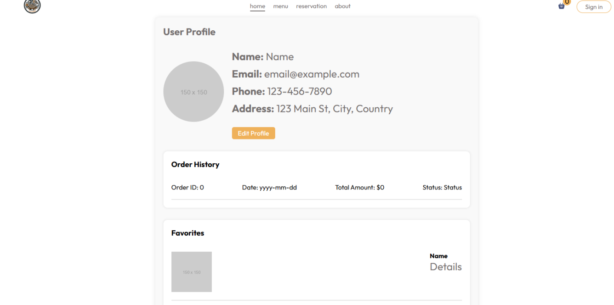

# GestionRestaurant-Beldi Flavored
## Developpement d’une plateforme de gestion de restaurant
## Introduction
Beldi Flavored est une plateforme de gestion de restaurant qui propose une solution complète et innovante pour optimiser les opérations quotidiennes et enrichir l'expérience client. Grâce à des fonctionnalités telles que la gestion des réservations, des stocks, du personnel et des menus, elle s'adapte aux besoins spécifiques de chaque établissement, qu'il s'agisse d'un restaurant indépendant ou d'une chaîne renommée.

  

## Services
Nous offrons une gamme de services pour répondre à vos besoins en gestion de restaurant :
- **Commandes de repas** : Notre plateforme permet aux utilisateurs de parcourir le menu, de passer des commandes et de suivre l'état de leur repas en temps réel.
- **Réservation de tables** : Les clients peuvent vérifier la disponibilité des tables et effectuer des réservations directement via la plateforme, avec des confirmations instantanées.
- **Tableau de bord administrateur** : Un tableau de bord complet pour la gestion du restaurant, incluant des outils pour la mise à jour des menus, la gestion des réservations et l'analyse des ventes.
- **Tableau de bord utilisateur** : Une interface intuitive permettant aux clients de consulter leurs commandes, réservations et historiques de transactions.
## Overview
### Interface Web 
Explorant maintenant notre interface web. La premiere page à voir c’est la page **Home**

Ensuite, la page **Menu** présente de manière attrayante et organisée par catégories les différents plats proposés par le restaurant, afin d'encourager les clients à passer commande.

À partir du menu, le client peut sélectionner les plats qu'il souhaite commander, puis procéder au paiement.

La page **Réservation** permet au client de réserver une table au restaurant, en commençant par le remplissage d'un formulaire avec les informations nécessaires.

Ensuite, il peut choisir la table

Et enfin, il sera rédigé sous une autre forme pour compléter la réservation et remplir les informations personnelles.

La page **About** fournit des informations sur l’historique, les services et autres détailles sur le restaurant.

Notre plateforme propose également des services de connexion et d'inscription. Les utilisateurs peuvent créer des comptes facilement, mais cela reste optionnel.

Il est également essentiel de se connecter, surtout pour un administrateur de la plateforme. Un tableau de bord administrateur permet d’ajouter, de supprimer et de modifier les plats, ainsi que de gérer les commandes et les réservations.

Un **User Dashboard** simple et facile a manipuler.

## Outils

Pour le développement de la plateforme Beldi Flavored, nous avons utilisé les outils et langages de programmation suivants :

  
  
  

- **React** : Bibliothèque JavaScript utilisée pour construire l'interface utilisateur, rendant l'application réactive et dynamique.
- **Spring Boot** : Framework utilisé pour créer des applications web robustes et évolutives.
- **MySQL** : Système de gestion de base de données pour stocker et gérer les données de la plateforme.

Cette combinaison d'outils et de langages permet de garantir la performance, la sécurité et la convivialité de notre plateforme.

**En conclusion**, notre projet de gestion de restaurant Beldi Flavored aspire à optimiser l’expérience client tout en valorisant la richesse de la cuisine locale.

**Team** 
- [Hnais Saaida](https://github.com/saaida1)
- [Elhasbi Amine](https://github.com/emine9999)
- [Es-samlali Essaadia](https://github.com/S3legend)
- [Lkhal Achraf](https://github.com/3lacker)
- [Knioui Brahim](https://github.com/rekkles0)
- [Ed-darrajy Hajar](https://github.com/haizy1)-Author
